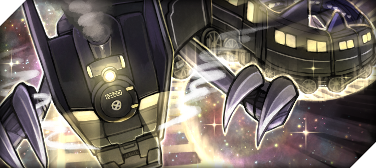

# Galaxy Engine

  

[Galaxy Train from Cross Universe](https://crossuniverse.jp/2009/01/10/%E9%8A%80%E6%B2%B3%E9%89%84%E9%81%93%E9%BE%8D%E3%80%80%E3%83%8A%E3%82%A4%E3%83%88%E3%83%BB%E3%83%89%E3%83%A9%E3%82%B4%E3%83%B399%E3%80%80lv9/)
  
The Galaxy engine is a Cross Universe rules engine written in Javascript, mainly for https://battle.crossuniverse.net.  
Yes, it is named after Galaxy Train, how could you tell?

## Development Setup

Working on the engine is currently easiest by just cloning the repo for [Cross Universe Online Battle](https://github.com/Psychpsyo/Cross-Universe-Online-Frontend) and using its local version for testing.

## LICENSE

Even though the code in this repo is licensed under the MIT License, the copyright for the Cross Universe card game itself belongs to [Cross Universe](https://crossuniverse.jp/).  
That means the MIT license can't cover the game itself, meaning you should also follow Cross Universe's own license, found here:  
English: https://crossuniverse.net/tos/  
Japanese: https://crossuniverse.jp/約束事/
